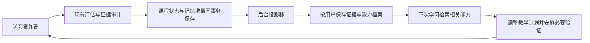

# 学习者记忆系统设计

状态：设计提案，尚未实现。日期：2026-09-09。

适用范围：WalrySuperAgent 教学服务与 cheerful-sitor Web。本文只设计，不修改业务代码、数据库或部署；cheerful-mini 不在本次范围内。

## 1. 结论与目标

建议在现有课程状态之上增加一个**按用户组织、以作答证据为依据的长期学习档案**。它回答三个问题：这个人学过什么；在哪些具体条件下证明过什么能力；这次学新内容时，应该从哪里开始、怎么教、还需要验证什么。

第一版复用 PostgreSQL，增加结构化能力档案和与之关联的学习经历。暂不引入独立向量数据库或全学科知识图谱。文本检索可以帮助找到相关经历，但“是否掌握”必须由证据与规则判断。

成功的体验是：用户换一个对话学新主题，老师仍记得他以前独立完成过的任务，少讲已经熟悉的部分，使用合适的旧知识搭桥，并针对尚未掌握的部分安排练习。用户不必反复介绍自己，也不会因为曾经点过“懂了”就被安排过难的内容。

### 一个贯穿示例

以下是产品示例，不代表当前用户已经具备这些能力：

用户以前学过 MySQL 行锁，能够独立解释事务之间为什么等待，也能辨别普通查询与加锁查询，但还没有解决过死锁案例。

后来用户开始学分布式锁，系统应当：

- 用“多个执行者争用资源”的已知机制作为入口，压缩重复的互斥概念介绍。
- 明确指出数据库锁和分布式锁在失效、租约与持有者身份上的差异。
- 先用一个小问题确认旧知识仍能用，再进入锁过期和旧持有者继续执行的问题。
- 不推断用户已经掌握分布式一致性，也不把新课程的节点直接标成已掌握。

## 2. 当前代码已经具备什么

本节依据当前本地源码核对，不代表线上部署状态。

| 当前能力 | 源码依据 | 对本设计的意义 |
| --- | --- | --- |
| 按课程保存学习状态与事件 | `src/tutor/store.ts`：`tutor_learning_sessions`、`tutor_conversations`、`tutor_learning_events` | 可复用持久化与事务基础 |
| 保存节点作答证据、误区、题目及提示情况 | `src/tutor/types.ts`：`LearningEvidence`、`NodeLearningState`、`TeachingQuestion` | 已有长期档案的重要原料 |
| 依据证据维度决定教学推进 | `src/tutor/pedagogy.ts`、`src/tutor/web-teaching.ts` | 长期记忆不能绕过现有教学规则 |
| 诊断形成背景、教学方式与已知直觉 | `TutorDiagnosis`、`TutorState.learnerProfile`、`knownIntuitions` | 当前主要局限于单门课程，可接入跨课程背景 |
| Markdown 通用记忆与 BM25 搜索 | `src/memory/store.ts`、`src/tools/memory-tools.ts` | 适合通用文本记忆；接口没有学习者身份、能力维度和证据约束 |
| Web 已验证课程归属 | `../cheerful-sitor/lib/server/conversations.ts`、`app/api/agent/runs/route.ts` | 可从登录用户建立可信学习者身份 |
| Web Agent 请求当前以会话定位 | `src/web/agent-service.ts` 的 `WebAgentRunInput`，Web 转发请求体 | 需要新增用户身份传递，不能用会话 ID 代替用户 ID |

两个现状限制必须正面处理：

1. `TutorState` 中的概念 ID 是课程模型的一部分，不能假定跨课程 ID 相同就代表同一能力，也不能只按标题合并。
2. 当前 `TutorStore.save(state, event)` 同时保存快照和事件，但默认事件可以只是 `state.saved` 元信息。不能假定历史事件已经包含可独立重放的完整作答证据。

`CONTEXT.md` 约定课程证据和进度不泄漏到其他课程。新增档案应作为显式的跨课程背景输入；原课程证据保持原归属，新课程仍独立产生证据和进度。实施时补充这个术语边界。

## 3. 记住什么，怎样使用

| 记忆 | 内容 | 教学用途 | 写入条件 |
| --- | --- | --- | --- |
| 学习经历 | 学习主题、目标、来源课程、接触时间、完成情况 | 回答“我学过什么”，找到关联经历 | 有真实课程或阅读活动即可；接触不等于掌握 |
| 能力证据 | 具体能力、作答原文、题目、标准、提示情况、验证时间 | 决定起点和练习目标 | 经过现有评估审计，有可追溯学习者表现 |
| 误区与薄弱点 | 误区描述、出现条件、修复证据 | 选择对照例子和补强任务 | 必须关联具体表现；一次失败不生成永久人格标签 |
| 学习偏好与约束 | 用户明确要求的解释方式、可用时间、目标 | 调整表达、节奏与任务长度 | 优先用户明确表达；模型推测单独标为推测 |
| 有效教学经历 | 某个例子或提示之后，用户在哪道新题上表现改善 | 选择可能合适的解释入口 | 记录关联，不把前后发生当作已证明的因果关系 |

不将助手讲解、文章内容、收藏划线、浏览时长、诊断自评或“明白了”直接写成已掌握。快问、阅读模式可以贡献学习经历；只有具备题目、标准和学习者表现的评估才能贡献能力证据。

不使用“逻辑能力差”“视觉型学习者”这样的固定标签。可以记录“上次在三变量因果题中遗漏了控制变量”，它具体、可检验、可更新。

## 4. 数据模型

### 4.1 身份与能力标识

`learnerId` 来自 Web 服务端验证过的登录身份，使用带来源命名空间的稳定标识，如 `cheerful:<user.id>`；不能接受浏览器提交的任意用户 ID。无身份的 CLI 或兼容调用继续单课程学习，不读取共享用户档案。

能力粒度为“能完成的具体任务”，而不是“学过某个大主题”。例如：

```text
能力：解释 InnoDB 事务之间的行锁等待
范围：指定事务与查询条件下的阻塞关系
标准：解释等待原因；辨别不阻塞的反例
非覆盖范围：死锁恢复；分布式锁；所有隔离级别行为
```

第一版使用小规模可维护的能力目录；目录内能力有稳定 `skillId`、定义版本和适用范围。目录外创建课程局部能力记录，不强行归一。模型可以提出候选映射，正式等价映射需要受控目录规则或后续审定。

关系区分 `equivalent`（等价）、`prerequisite`（先修）、`analogy`（可作类比）。后两者不能转移掌握状态。跨域相似度只允许提供类比候选。

### 4.2 建议表结构

下表是逻辑结构，实施时再转换为迁移 SQL。所有用户数据查询必须包含 `learner_id`；表间引用使用带 `learner_id` 的复合约束，避免仅凭对象 ID 跨用户读取。

| 表 | 核心字段 | 约束与职责 |
| --- | --- | --- |
| `learner_profiles` | `learner_id`、`preferences_json`、`memory_enabled`、`revision` | 用户偏好及总版本；偏好保留来源与更新时间 |
| `learner_session_links` | `learner_id`、`conversation_id`、`learning_session_id` | 唯一课程归属；以 Web 已核验关系建立，禁止重新绑定给另一用户 |
| `learning_skill_definitions` | `skill_id`、`version`、`definition`、`scope_json`、`rubric_json` | 不含个人信息的能力目录 |
| `learner_experiences` | `learner_id`、`experience_id`、来源课程、主题、接触/完成时间、摘要 | 保存“学过”；摘要关联来源，不授予掌握 |
| `learner_evidence` | `learner_id`、`evidence_id`、`source_event_id`、课程/节点/题目/回答 ID、`skill_id`、`skill_version`、`criterion`、`quote`、`support`、`strength`、`verification`、`observed_at`、`policy_version`、`status` | 证据事实；同一来源和维度幂等去重，撤销用状态表达 |
| `learner_skill_states` | `learner_id`、`skill_id`、`skill_version`、`criteria_json`、`misconceptions_json`、`last_verified_at`、`review_after`、`revision` | 可从有效证据重建的能力投影，不是新的事实来源 |
| `learner_memory_outbox` | `event_id`、`learner_id`、来源课程版本、证据增量载荷、`status`、重试信息 | 与课程保存同事务落库，异步可靠投影 |
| `learner_memory_uses` | `learner_id`、`run_id`、`profile_revision`、使用的证据 ID、教学调整、理由码 | 解释“为什么这样教”，支持评估和回放 |

证据额外保存题干/评分标准的版本化快照或稳定引用，不能只留下无法理解的“B”。`answerId` 在服务端接受回答时生成，并绑定请求幂等键；幂等唯一键至少包含用户、来源课程、回答 ID、能力版本和证据维度。同一回答针对不同维度可以有多条证据，但不能伪装成多次独立练习。

### 4.3 能力不是一个总分

延续现有 `accurate / explained / discrimination / transfer / performance` 维度，按能力所需的 rubric 判断，避免一个“85 分”掩盖不会迁移的事实。

每个维度分别保存：

- 证明程度：`unknown`、`assisted`、`independent`。
- 最近核验时间，以及是否有相反证据 `needs_recheck`。
- 支持该判断的证据 ID、任务范围与标准版本。

对用户可显示“接触过”“提示下可完成”“可独立完成”“已验证迁移”，另附“建议复核”。迁移能力不自动推导所有其他维度合格；完整掌握仍要满足该能力的全部要求。

`performance` 必须有适用的实际操作/产物验证渠道；当前 Web 审计会将这一类口头候选证据降为弱证据，第一版不得通过记忆层把它重新升级。

## 5. 如何写入、更新和纠正



写入时机是“经审计的证据被持久化”或“有明确的经历/偏好变化”，不必等整门课程完成。

1. 在 `TutorOrchestrator` 中继续完成语义评估和现有规则审计，只输出新增或撤销的证据增量。
2. `TutorStore` 扩展事务入口，原课程状态、原审计事件及 outbox 一起提交。模型调用和跨服务访问不放在数据库事务内。
3. Worker 消费 outbox，验证用户归属、来源完整性、能力映射和 schema，再幂等写入证据、重建受影响能力。证据写入、投影版本递增、事件已消费标记在同一事务提交。
4. 同一用户能力更新采用行锁或版本比较后重试；按来源时间及因果版本处理更正，不能让晚到的旧事件覆盖较新的撤销。
5. 投影失败保留待处理事件并重试；教学可继续使用已提交的课程状态。档案尚未同步时明确视为旧版本，不声称“已经记住”。

`MemoryPolicy` 是新增的无模型规则模块：过滤证据、聚合维度、处理冲突、计算待复核状态。模型负责提取候选含义和生成教学内容，不直接修改最终能力状态。

### 具体规则

| 情况 | 更新结果 |
| --- | --- |
| 无提示、可追溯的回答满足某维度标准 | 将该维度记录为有独立证据；仍保留任务范围 |
| 看过提示或完整示范后答对 | 记录辅助下完成；不增加独立掌握证据 |
| 用户说“以前学过” | 记录自述背景，优先安排短验证 |
| 同一回答重试、事件重复投递 | 去重，不增加证据数量或强度 |
| 曾独立完成，今天失败 | 保存两次事实，标为待复核；针对失败条件教学，不抹掉历史 |
| 用户说“我已经忘了” | 当前教学按需补基础；标记待复核，保留历史曾通过的事实 |
| 用户指出评分错误 | 将受质疑证据暂停用于个性化，重新评估或撤销；更正链可追溯 |
| 证据缺题目、来源不明、来自模型降级路径 | 可保留经历或弱候选，不升级独立能力 |

时间流逝不表示已确定遗忘。第一版可采用可配置的 7/30/90 天复核分档作为工程启发式，具体间隔取决于任务要求和近期表现；这些数值不是经过验证的遗忘概率模型。复核成功更新核验时间，失败产生冲突证据。

## 6. 新课如何根据旧能力调整

采用两次读取，避免还没确定要学什么就加载整个用户档案。

1. 用户发起新目标：读取明确偏好、相关主题经历，帮助生成目标模型。
2. `TopicModel` 生成后：按当前节点和先修要求匹配能力目录，再检索用户证据。
3. `MemoryPolicy` 过滤不可靠、撤销、不匹配的记录，形成有大小上限的 `LearnerContext`。
4. 诊断与路线生成使用该上下文，规则层审核建议；当前用户目标和本轮表现优先。
5. 教学响应记录本轮引用的档案版本、证据和调整理由。

建议上下文结构：

```ts
type LearnerContext = {
  learnerId: string;
  profileRevision: number;
  explicitPreferences: Array<{ key: string; value: string }>;
  relevantSkills: Array<{
    skillId: string;
    relation: "equivalent" | "prerequisite" | "analogy";
    scope: string;
    independentCriteria: string[];
    missingCriteria: string[];
    needsRecheck: boolean;
    evidenceIds: string[];
  }>;
  relevantMisconceptions: Array<{ description: string; evidenceIds: string[] }>;
  usefulExperiences: Array<{ summary: string; sourceSessionId: string }>;
};
```

第一版默认最多带入 8 项相关能力、3 个误区和 2 个经历摘要，总预算约 1,500 tokens；这些是可调预算。先保留当前任务的先修缺口和必要来源 ID，截断摘要，不能为了填满预算补充不相关个人信息。

检索优先级：已确认等价映射 → 直接先修关系 → 同领域关键词 → 类比候选。先按用户和记录有效性过滤，再排序。后续如增加向量检索，同样必须在用户隔离条件内召回；向量相似度不参与掌握判定。

| 历史背景 | 这次的教学调整 |
| --- | --- |
| 同能力、范围匹配、证据较新 | 压缩重复讲解，从短验证或应用开始 |
| 只在提示下完成过 | 保留必要讲解，安排新的无提示任务 |
| 已掌握先修能力 | 使用其术语和机制作为起点，聚焦新差异 |
| 仅有类比关系 | 使用旧场景搭桥，同时说明类比边界 |
| 存在相关未修复误区 | 先用一个对照案例验证并修复 |
| 没有记忆、记忆读取失败 | 回到现有诊断流程，不虚构背景 |

MVP 只加速讲解与诊断，不自动跳过整段课程，更不直接写 `roadmap.status = mastered`。如未来支持免修，需新增独立的“已验证先修/免修”决策与覆盖标准，不能复用 `knownIntuitions` 冒充新课程证据。

教学中的自然表达示例：“你之前已经解释清楚事务为什么等待，这次从锁失效后会发生什么开始。”使用者可展开查看依据，也可以直接选择“从基础讲”。

## 7. 用户体验与控制

Web 增加“我的学习档案”，第一版使用列表与详情即可，不先建设复杂能力地图。

- **我学过的**：课程、主题、最近学习时间、进展。
- **我能做的**：具体能力、独立/辅助完成状态、最近核验时间、仍缺的维度。
- **需要巩固的**：待复核能力和具体误区。
- **教学偏好**：用户明确设置的解释方式、学习目标与时间约束。

能力详情必须显示至少一个可理解的证据出处：来自哪门课、题目是什么、当时怎么回答、有没有提示。用户可纠正、删除该条记忆、请求重新验证。

新课显示简短的“本次已参考你的学习记录”，展开后看到实际使用的能力及其对路线的影响。提供“本次从基础开始”；这是单次教学覆盖，不删除长期档案。

设置提供“启用学习记忆”和“清空学习档案”。关闭后停止长期记忆读取与新增投影，课程自身进度仍正常保存。重新开启默认只处理新事件，旧经历回填是独立操作，避免静默恢复用户不希望保留的记忆。

## 8. 服务边界与接入位置

新增模块建议放在 `src/tutor/learner-memory/`：

| 模块 | 职责 |
| --- | --- |
| `types.ts` | 档案、证据增量和上下文契约 |
| `store.ts` | 用户隔离查询、事务、幂等与版本管理 |
| `policy.ts` | 证据准入、维度聚合、冲突和复核规则 |
| `skill-resolver.ts` | 能力目录及节点映射；不确定映射只作候选 |
| `projector.ts` | outbox 消费、投影重建、重试 |
| `context-builder.ts` | 两阶段读取、相关性过滤和上下文预算 |

现有代码接入位置：

- `src/web/server.ts`、`src/web/agent-service.ts`：接收并验证服务端学习者上下文，传入编排器。
- `src/tutor/orchestrator.ts`：建立课程身份关联，在主题生成/诊断前后读取档案，在持久化时提交增量。
- `src/tutor/model-client.ts`：显式接收 `LearnerContext`；将其作为背景数据，与用户当前指令和课程证据分开。
- `src/tutor/store.ts`：增加事务内 outbox 写入；保留文件模式供测试及兼容，文件模式不自动提供多用户长期档案。
- `src/tutor/types.ts`：新增记忆引用与版本字段；如改变持久化结构，增加新 schema 版本并迁移，避免静默复用 v5。
- cheerful-sitor `app/api/agent/runs/route.ts`：由登录态构造学习者身份，不透传客户端声明。
- cheerful-sitor 档案 API 与页面：只负责展示、用户修改和授权，不承担掌握判定。

建议 Web API：

```text
GET    /api/learning-memory             分页获取自己的档案
GET    /api/learning-memory/skills/:id  能力详情与证据
PATCH  /api/learning-memory/preferences 修改明确偏好/启用设置
POST   /api/learning-memory/corrections 提交证据纠正
DELETE /api/learning-memory/items/:id   删除一个记忆项
DELETE /api/learning-memory            清空自己的学习档案
```

这些都是待实现的接口。内部调用以经验证的服务身份传递 `learnerId`，建议使用签名服务请求并绑定请求体与时效；Walry 同时核对会话归属。只增加请求体字段而不验证调用来源，不能构成可信身份。

读取档案短超时后走无记忆诊断；投影异步重试。关闭记忆、撤销和删除则必须立即影响检索资格，不能等待摘要重建才能生效。每次使用前检查用户启用状态和当前撤销版本。

## 9. 历史迁移、删除与一致性

### 历史回填

1. 通过 `cheerful_conversations.user_id → walry_conversation_id` 建立课程归属。缺失或冲突的课程不自动关联。
2. 首先从当前课程快照回填学习经历与候选证据；默认保存“历史导入”来源标识。
3. 只有题目、原文、rubric、提示情况及验证信息完整的记录，才允许按相同准入规则形成能力证据。只有节点 `mastered` 标签的记录不能直接导入为独立掌握。
4. 能力等价关系无法确认时保留课程局部记录，不进入跨课免修或掌握迁移。
5. 使用稳定导入键保证重复回填结果不变；先输出数量和排除原因，再按用户逐批导入。

### 删除语义

当前 Web 删除会话的实现会删除该会话的 tutor 状态与事件。新增记忆必须接入同一删除链路：默认同步删除该课程派生的证据与经历，重算受影响能力；其他课程提供的能力证据保留。

用户删除单项长期记忆时，课程聊天可以保留，但要建立不含原文的抑制记录，阻止旧 outbox、重放和回填重新生成该记忆。清空档案同样更新用户的导入边界/删除版本；未来新作答可按设置形成新记录。

本地事务内同步撤销检索资格并写删除任务，后台清理派生摘要和缓存。若跨数据库，使用删除事件可靠传播，而不是假设跨库事务成立。被删除的原文不能为了“不可变审计”继续保存在记忆日志中；仅保留必要的操作 ID、时间和删除状态。

## 10. 分阶段实施

### 阶段一：身份、可靠记录、可查看

完成可信身份传递、课程关联、结构化证据、outbox、投影器、档案基础页面及纠正删除。能力目录先覆盖一组代表性课程，目录外显示经历与局部证据。

完成标准：同一用户跨对话能看到真实学习记录；不同用户隔离；重复请求不重复计数；提示后作答和助手输出不被标为独立掌握；服务重启不丢待处理事件。

### 阶段二：闭环个性化（达到本需求的最低完整版本）

接入两阶段检索、诊断、教学起点与练习选择；展示本次使用依据；支持从基础开始、过期复核和冲突处理。

完成标准：相同新目标在“无记录”“辅助完成过”“独立通过过”三种历史下产生可解释的不同教学安排，且所有人仍按实际新作答获得新课程掌握状态。

只完成阶段一不能宣称用户需求已实现：记录必须实际改变后续教学。

### 阶段三：扩大覆盖与优化

扩展能力目录、跨课程概念映射、复习排序和必要的混合检索；根据实际验证数据调整复核间隔。全学科知识图谱、自动免修、复杂遗忘概率模型和主动通知均放到后续，不作为第一版依赖。

## 11. 验收方案

| 场景 | 必须观察到的结果 |
| --- | --- |
| A 在课程一独立解释行锁，再开分布式锁课程 | 新课引用对应经历，压缩互斥基础，验证租约等新差异；无自动掌握 |
| A 只看讲解或点“懂了” | 有学习经历，没有新增独立能力 |
| A 使用提示后答对 | 显示辅助完成；后续安排无提示任务 |
| 用户 B 学同一目标 | 看不到 A 的经历、引用和偏好 |
| 老能力很久未验证，新任务依赖它 | 给出简短复核，不直接说用户已遗忘 |
| 历史成功、本轮失败 | 保留历史并标记待复核，本轮教学补对应缺口 |
| 同一事件重复投递、Worker 重启 | 证据不重复，投影可恢复 |
| 两门课同时更新同一能力 | 证据均保留，不丢失较新更正 |
| 删除课程或单项记忆后重放旧事件 | 删除内容不再参与教学且不复活 |
| 档案读取或投影不可用 | 当前教学继续，使用现有诊断，不输出虚构记忆 |
| 能力标题相同但范围不同 | 不自动合并；只能进入候选关系 |

实现时以规则单元测试验证准入/冲突，用真实 PostgreSQL 验证事务、隔离与幂等，再用两个账号和跨对话浏览器流程验收完整闭环。单纯接口返回成功或数据库存在记录不能证明个性化有效。

上线观察三类指标：记忆引用的来源有效率和错误引用率；减少重复基础诊断的程度；个性化后的新任务独立完成情况。先建立无记忆基线，再比较结果，不能用“生成了多少记忆”代表学习效果。

## 12. 本提案的默认决策

建议按以下选择直接进入后续实现拆解：PostgreSQL 结构化档案；证据驱动；保持现有教学规则；记忆归属用户；小能力目录起步；学习后异步更新；新课按需读取；用户可查看纠正删除；历史只做保守回填；第一版不自动免修。

核心验收问题始终是：**系统能否根据这个人以前实际证明过的能力，把下一次学习安排得更合适，同时允许新表现推翻旧判断？**
