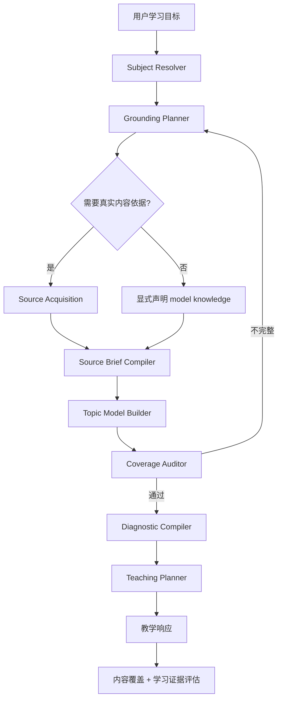

# 第6次迭代 - 没有真实搜索的问题

## 1. 迭代结论

本次问题不能只通过修改最终回答 Prompt 解决。当前 Tutor 的根本问题是：系统在没有取得真实来源内容的情况下，直接用模型已有知识生成 TopicModel；随后又把 TopicModel 当成已经完成研究的课程事实基础。

因此，本次迭代的目标不是“让回答更详细”，而是建立一条可以验证的内容链路：

```text
识别学习对象
  → 判断需要什么依据
  → 真实取得来源
  → 生成来源摘要
  → 建立完整内容模型
  → 检查核心内容覆盖
  → 诊断学习者起点
  → 选择教学深度
  → 先讲不可推导事实，再引导可推导机制
  → 基于内容覆盖和学习证据共同判断掌握
```

一句话概括：

> 先确保系统真正知道“要教什么”，再优化“怎么教”。

---

## 2. 为什么这次没有真实搜索

### 2.1 直接结论

这次没有真实搜索，同时存在两个问题，但主次关系非常明确：

1. **架构主因：Tutor 路径没有接入搜索工具。**
2. **配置次因：当前运行环境也没有配置搜索 Key。**

不是“大模型识别到了需要搜索，但忘记调用”，也不能简单归因于“模型没识别需要搜索”。在当前实现里，Tutor 使用的是不带工具的 `generateText`，模型根本没有调用 `web_search` 的机会。

即使现在只补上搜索 Key，Tutor 依然不会搜索；必须先把真实内容取得能力接入 Tutor 工作流。

### 2.2 架构主因：Tutor 绕开了工具 Agent

Web 请求一旦被识别为系统学习意图，就直接进入 `TutorOrchestrator`：

```ts
if (tutorSession || this.tutor.isTutorIntent(input.message)) {
  await this.tutor.run(...);
  return;
}
```

对应代码：`src/web/agent-service.ts`。

Tutor 创建 TopicModel 时，直接调用：

```ts
generateText({
  model,
  system,
  prompt,
});
```

对应代码：`src/tutor/model-client.ts`。

这个调用没有传入 `tools`，也没有进入 `agentLoop`，因此不能调用：

- `web_search`
- `web_fetch`
- RAG
- 本地材料读取
- 任何其他内容取得工具

普通 Agent 路径虽然存在工具注册表，但它和 Tutor 是两条分离的执行路径。普通 CLI Agent 会注册 `allTools`，其中包含 `pickSearchTool()` 和 `webFetchTool`；Web Agent 首版只注册了计算器和天气；Tutor 则完全没有工具循环。

所以本次实际执行的是：

```text
用户说“我想学习《穷爸爸富爸爸》”
  → 无工具 generateText
  → 模型根据自身记忆生成 TopicModel
  → 系统把 TopicModel 当作研究结果
```

### 2.3 配置次因：搜索 Key 当前也未配置

仓库的搜索实现支持两个后端：

- `TAVILY_API_KEY`
- `SERPER_API_KEY`

当前 `.env` 和 `.env.deepseek` 中，这两个 Key 都未配置。运行时检查结果为：

```json
{
  "TAVILY_API_KEY": false,
  "SERPER_API_KEY": false
}
```

如果普通 Agent 调用了 `web_search`，当前只会返回：

```text
[web_search] 未配置 TAVILY_API_KEY，请在 .env 中设置
```

但需要强调：**本次 Tutor 连这个错误都不会触发，因为它根本没有获得 `web_search` 工具。**

因此修复顺序必须是：

1. 为 Tutor 建立可执行的内容取得层；
2. 配置至少一个搜索后端；
3. 增加启动时能力检查；
4. 没有搜索能力时明确降级，不得伪装成研究完成。

### 2.4 模型其实已经暴露了“没有来源”的事实

本次 TopicModel 中同时出现了两组矛盾信息：

```json
{
  "mode": "user_named_book_without_source_material",
  "limitations": ["未提供可直接核验的学习材料"]
}
```

这说明模型知道没有取得原文或外部来源。

但它又把下面这项标成了 verified：

```json
{
  "label": "用户明确指定：《穷爸爸富爸爸》",
  "verified": true
}
```

Orchestrator 只统计 `verified === true` 的数量，于是错误发出：

```json
{
  "type": "research.completed",
  "sourceCount": 1
}
```

这里混淆了两种完全不同的“已验证”：

- 已验证用户的学习对象确实叫《穷爸爸富爸爸》；
- 已验证系统已经取得《穷爸爸富爸爸》的内容。

前者不能证明后者。

---

## 3. 第一性原理：一个学习 Agent 最少需要完成什么

一个可靠的学习 Agent 必须分别解决四个问题：

1. **学习对象是什么？**
2. **这个学习对象真正包含什么？**
3. **学习者已经会什么、不会什么？**
4. **当前内容应该先讲、先问、示范还是练习？**

当前系统把第 2 个问题压缩成了“模型生成一个课程路线”，然后直接进入第 3、4 个问题。

但教学互动无法弥补内容缺失：

```text
没有取得人物背景
  → TopicModel 不包含人物背景
  → responsePlan 不允许讲人物背景
  → 模型只能讨论抽象的“两套观念”
  → 用户再怎么回答，也学不到被丢掉的故事
```

所以第 6 次迭代必须把“内容取得”和“教学互动”拆成两个独立且可观测的阶段。

---

## 4. 当前链路的具体问题

### 4.1 假研究完成

当前 `research.completed` 的判定条件是：

```ts
topicModel.grounding.sources.filter(source => source.verified).length > 0
```

这个条件不能证明发生过真实检索，也不能证明取得了可支持课程内容的来源。

### 4.2 TopicModel 过薄

当前路线节点只有：

```ts
{
  id: string;
  title: string;
  target: string;
}
```

它能描述教学目标，却不能保存可教学内容。以下信息没有稳定载体：

- 背景故事；
- 关键事实；
- 论证流程；
- 核心定义；
- 经典例子；
- 来源引用；
- 内容重要度；
- 哪些事实必须先讲；
- 哪些问题可以让学习者推导。

### 4.3 路线覆盖没有审计

《穷爸爸富爸爸》的 TopicModel 标题和总目标包含“资产、负债”，路线却把它泛化成“财务知识的重要性”。系统没有检查核心概念是否被明确、独立地保留下来。

### 4.4 诊断被错误地当成结课考试

用户答对一个资产定义题和两个现金流选择题后，整项“财务知识的重要性”被标记为 `known`。

但识别正确答案只证明学习者有概念直觉，不证明其已掌握：

- 资产与负债的完整关系；
- 收入、支出和现金流；
- 三类现金流模式；
- 中产阶级陷阱；
- 自住房论点；
- 与正式会计定义的区别。

### 4.5 苏格拉底式提问没有知识类型边界

当前首轮问题固定为：

```text
结合你的理解，你认为“当前节点”最关键的区别或机制是什么？
```

它没有区分：

- 事实型知识；
- 故事型知识；
- 机制型知识；
- 程序型技能；
- 价值判断和边界问题。

结果是对没读过书的用户，也先让其猜书里的故事和观点。

### 4.6 掌握指标替代了内容目标

当前节点只要积累 `accurate / explained / discrimination / transfer` 四类证据，就可以判定 mastered。

这能验证学习者是否会表达和迁移，却没有验证本节点的必学内容是否已经真正教授和覆盖。

---

## 5. 目标架构



核心变化是新增三个独立职责：

1. `GroundingPlanner`：判断需要什么来源；
2. `SourceAcquisition`：真正搜索、抓取或读取材料；
3. `CoverageAuditor`：检查路线是否遗漏主题核心内容。

---

## 6. 搜索触发机制：不能只靠模型自由决定

### 6.1 采用“确定性门控 + 模型规划”

搜索不应完全依赖模型临场判断，也不应所有主题都强制联网。

先由确定性规则判断是否必须取得外部依据，再让模型生成具体查询计划。

建议规则：

| 学习对象 | 默认策略 |
|---|---|
| 用户上传的书、论文、文章 | 优先读取用户材料，不自动用网页替代 |
| 用户只给书名、论文名、文章名 | 必须取得目录、可信摘要或可访问原文 |
| 历史事件、人物思想、作品背景 | 必须取得背景来源 |
| 时效性主题、产品、法规、版本 | 必须搜索 |
| 数学定理、稳定基础概念 | 可使用模型知识，但必须声明依据模式 |
| 用户明确要求联网或核实 | 必须搜索 |
| 搜索能力不可用 | 明确降级，禁止发出 research.completed |

### 6.2 GroundingDecision

新增结构：

```ts
type GroundingDecision = {
  required: boolean;
  reason: string;
  sourceNeeds: Array<{
    purpose: "identity" | "background" | "structure" | "core-content" | "latest" | "boundary";
    query: string;
    preferredSourceTypes: string[];
  }>;
  fallbackPolicy: "ask-material" | "model-knowledge-with-warning" | "block";
};
```

### 6.3 搜索失败不能静默降级

以下情况必须生成可观测状态：

- Key 未配置；
- 搜索服务请求失败；
- 搜索无结果；
- 网页无法抓取；
- 来源质量不足；
- 来源相互冲突。

建议事件：

```ts
type GroundingEvent =
  | { type: "grounding.planned"; decision: GroundingDecision }
  | { type: "source.search.started"; query: string }
  | { type: "source.search.completed"; resultCount: number }
  | { type: "source.fetch.completed"; sourceId: string }
  | { type: "source.acquisition.failed"; reason: string }
  | { type: "grounding.degraded"; mode: string; limitation: string };
```

---

## 7. 重新定义“已验证来源”

不能继续用一个 `verified: boolean` 同时表示不同含义。

建议改为：

```ts
type GroundingSource = {
  id: string;
  label: string;
  uri?: string;
  kind: "user-material" | "web-page" | "search-snippet" | "local-resource" | "model-knowledge";
  acquisition: "uploaded" | "fetched" | "searched" | "provided-name" | "generated";
  supports: Array<"identity" | "background" | "structure" | "claim" | "example" | "boundary">;
  contentAvailable: boolean;
  contentVerified: boolean;
  fetchedAt?: string;
  limitations: string[];
};
```

只有满足以下条件，才允许发出 `research.completed`：

```text
至少一个来源 contentAvailable = true
并且
至少一个来源支持 background / structure / claim / example 中的一项
并且
本轮真实发生过 uploaded / fetched / searched
```

“用户提供了书名”只能标记：

```json
{
  "acquisition": "provided-name",
  "supports": ["identity"],
  "contentAvailable": false,
  "contentVerified": false
}
```

---

## 8. SourceBrief：先总结来源，再生成课程

取得来源后，不应把搜索片段直接塞给最终回答模型。需要先编译成结构化来源摘要。

```ts
type SourceBrief = {
  subjectIdentity: string;
  sourceIds: string[];
  background: Array<{
    fact: string;
    whyItMatters: string;
    sourceIds: string[];
  }>;
  centralClaims: Array<{
    claim: string;
    explanation: string;
    sourceIds: string[];
  }>;
  narrativeOrArgumentFlow: string[];
  coreConcepts: Array<{
    name: string;
    definition: string;
    importance: "core" | "supporting";
    sourceIds: string[];
  }>;
  keyExamples: Array<{
    example: string;
    teaches: string;
    sourceIds: string[];
  }>;
  boundaries: Array<{
    issue: string;
    explanation: string;
    sourceIds: string[];
  }>;
  unresolvedGaps: string[];
};
```

对于《穷爸爸富爸爸》，SourceBrief 至少应保留：

- 两个爸爸的故事背景及其叙事作用；
- “我付不起”与“我怎样才能付得起”的对照；
- 富人不为钱工作的核心机制；
- 资产与负债的现金流定义；
- 穷人、中产、富人的现金流模式；
- 关注自己的事业；
- 财商相关知识领域；
- 税收与公司的观点及制度边界；
- 投资、学习技能、心理障碍和行动指南。

---

## 9. 扩展 TopicModel，避免内容在上游丢失

路线节点建议改为：

```ts
type ConceptRouteNode = {
  id: string;
  title: string;
  target: string;
  importance: "core" | "supporting";
  knowledgeType: "fact" | "story" | "concept" | "mechanism" | "procedure" | "judgment";
  prerequisites: string[];
  coreIdeas: string[];
  keyFacts: string[];
  keyStoriesOrExamples: string[];
  sourceIds: string[];
  mustTeachBeforeQuestion: string[];
  inferableQuestions: string[];
  skippable: boolean;
};
```

其中：

- `coreIdeas` 保留不能丢的概念；
- `keyFacts` 保留人物、历史、定义等事实；
- `keyStoriesOrExamples` 保留教材真正用于解释概念的例子；
- `mustTeachBeforeQuestion` 防止让用户猜未知事实；
- `inferableQuestions` 才是适合苏格拉底追问的内容；
- `skippable` 防止诊断题跳过核心章节。

---

## 10. 背景介绍规则

不是所有主题都需要长篇背景，但以下条件满足任意一项时，应在进入核心概念前介绍背景：

1. 背景是主题产生的原因；
2. 背景解释作者为什么提出该观点；
3. 主题通过人物、事件或故事展开；
4. 缺少背景会让核心概念显得突兀或被误解；
5. 用户学习的是一部具体作品，而不是只查询一个定义。

背景输出顺序建议为：

```text
发生了什么
  → 涉及谁
  → 为什么形成这个主题
  → 这段背景与接下来要学的核心有什么关系
```

背景不是百科式堆砌，只保留对理解主线有因果作用的内容。

---

## 11. 路线覆盖审计

TopicModel 生成后必须经过独立 Coverage Auditor，不允许直接进入诊断。

```ts
type CoverageAudit = {
  passed: boolean;
  coreConceptsExpected: string[];
  coveredConcepts: string[];
  missingConcepts: string[];
  overlyGenericNodes: Array<{
    nodeId: string;
    problem: string;
    suggestedSplit: string[];
  }>;
  orderingProblems: string[];
  unsupportedNodes: string[];
};
```

审计规则：

- 核心概念不能只藏在某个节点的 target 中；
- 核心概念应在节点标题或 `coreIdeas` 中明确出现；
- 来源明确强调的核心章节不得遗漏；
- 节点标题过度泛化时必须拆分；
- 每个核心节点必须有来源或明确的 model-knowledge 限制；
- 路线顺序应符合内容依赖或源材料结构。

在本案例中，审计器应把：

```text
财务知识的重要性
```

识别为过于泛化，并至少要求明确保留：

```text
资产与负债：现金流定义与中产阶级陷阱
```

---

## 12. 诊断只调节深度，不轻易删除核心内容

### 12.1 新的诊断状态

建议把 `known` 拆成：

```ts
type DiagnosticDepth =
  | "full"       // 完整教学
  | "accelerated"// 快速复习后做迁移验证
  | "challenge"  // 直接进入高难应用验证
  | "verified";  // 已有充分开放式证据，可跳过
```

### 12.2 选择题不能直接跳过核心节点

规则建议：

- 单个选择题答对：最多标记 `accelerated`；
- 多个同构选择题答对：仍不能证明完整掌握；
- 开放式解释 + 辨析 + 新场景迁移：可以标记 `challenge`；
- 只有来源覆盖项均有充分证据，才能标记 `verified`；
- `importance: core` 且 `skippable: false` 的节点至少要完成一次内容校准。

因此，本案例中用户答对资产定义后，正确行为是：

```text
不从零解释“资产”这个词
  → 快速确认定义
  → 补充三种现金流模式、中产陷阱和边界
  → 用新案例验证迁移
```

而不是把整个章节标记为 known。

---

## 13. 根据知识类型选择“先讲还是先问”

| 知识类型 | 默认教学动作 |
|---|---|
| 人物背景、历史事实、作品情节 | 先讲，再问意义 |
| 新定义 | 先给定义和正反例，再让用户辨析 |
| 可推导机制 | 给必要条件后先问 |
| 操作技能 | 先示范，再让用户练习 |
| 常见误区 | 先给案例让用户判断，再修复 |
| 价值判断和适用边界 | 提供事实基础后讨论 |

教学决策器应增加硬规则：

```text
不得要求学习者推导来源专属事实。
不得把用户的常识性猜测当作已经学会了源材料。
问题只能基于本轮已讲内容、用户明确已有知识或可观察材料。
```

理想的节点循环应为：

```text
来源摘要
  → 最小完整知识块
  → 一个理解问题
  → 根据回答补充或纠偏
  → 新场景迁移
  → 内容覆盖检查
  → 掌握检查
```

“最小”不等于“残缺”。一个知识块必须保留理解当前概念所需的完整因果关系。

---

## 14. 掌握判定必须同时满足两条线

新的 mastered 条件：

### 14.1 内容覆盖线

- 节点所有 `requiredContentItems` 已教授或经证据确认；
- 没有未处理的核心来源事实；
- 没有开放中的关键误解；
- 核心边界已经说明。

### 14.2 学习者证据线

- accurate；
- explained；
- discrimination；
- transfer；
- 技能型主题还需 performance。

建议新增：

```ts
type NodeLearningState = {
  taughtContentIds: string[];
  verifiedPriorKnowledgeIds: string[];
  remainingContentIds: string[];
  evidence: LearningEvidence[];
  misconceptions: Misconception[];
  stage: NodeStage;
};
```

只有内容覆盖线和学习证据线同时通过，节点才能 mastered。

---

## 15. 实施方案

### 阶段一：纠正错误信号

涉及文件：

- `src/tutor/types.ts`
- `src/tutor/orchestrator.ts`
- `src/tutor/model-client.ts`
- `src/tutor/orchestrator.test.ts`

工作项：

1. 拆分 source identity 与 content verification；
2. 禁止 `provided-name` 触发 `research.completed`；
3. 没有内容来源时发出 `grounding.degraded`；
4. UI 不再显示虚假的“研究完成”；
5. 修复 `known` 节点仍被推进为 active 的状态矛盾。

### 阶段二：接入真实内容取得层

建议新增：

- `src/tutor/grounding-planner.ts`
- `src/tutor/source-acquirer.ts`
- `src/tutor/source-brief.ts`

工作项：

1. 把 `web_search`、`web_fetch` 抽象成 Tutor 可调用的只读依赖；
2. 支持用户材料优先；
3. 支持搜索失败和无 Key 的显式降级；
4. 保存来源 URL、取得方式、时间和支持的事实类型；
5. 由 SourceBrief 编译器生成可供课程设计使用的内容摘要。

不要直接让 Tutor 复用拥有全部本地能力的完整 Agent Registry。Tutor 只需要最小只读能力：

- 搜索；
- 网页读取；
- 用户材料读取；
- RAG 查询。

### 阶段三：扩展内容模型与覆盖审计

工作项：

1. 扩展 `ConceptRouteNode`；
2. 增加背景、关键事实、例子、来源和知识类型；
3. 新增 Coverage Auditor；
4. 审计失败时自动重新生成 TopicModel；
5. 核心概念不得被泛化节点吞并。

### 阶段四：修复教学与诊断策略

工作项：

1. 用 `DiagnosticDepth` 替代简单 known/locked；
2. 核心节点禁止被选择题直接跳过；
3. 首轮教学根据 knowledgeType 选择先讲或先问；
4. mastered 增加内容覆盖门槛；
5. 允许来源密集节点进行较完整总结，不强制每轮都立即追问。

---

## 16. 搜索配置建议

至少配置一个后端：

```env
TAVILY_API_KEY=...
```

或：

```env
SERPER_API_KEY=...
```

建议启动时打印能力状态，但不能打印 Key：

```text
[Tutor Grounding]
- web_search: available (tavily)
- web_fetch: available
- user_material: available
- fallback: model-knowledge-with-warning
```

如果两个 Key 都没有配置：

```text
[Tutor Grounding] web_search unavailable: no search provider configured
```

此时对于必须搜索的任务：

- 有用户材料：使用用户材料；
- 无用户材料：请求用户提供材料，或明确说明将使用可能不完整的模型知识；
- 不得显示“正在研究”或“研究完成”；
- 不得把模型生成的来源名称标为已验证内容。

---

## 17. 测试与验收标准

### 17.1 搜索能力测试

1. 未配置 Key 时，必须返回结构化 unavailable 状态；
2. 未配置 Key 时不得出现 `research.completed`；
3. 配置 Tavily 或 Serper 后，Tutor 能执行真实搜索；
4. 搜索完成事件必须包含真实 resultCount；
5. 网页抓取失败不得伪造成有效来源。

### 17.2 来源语义测试

1. 用户只说一个书名时，只验证 subject identity；
2. `provided-name` 不能设置 `contentVerified: true`；
3. 模型已有知识不能算真实研究来源；
4. `research.completed` 必须能追溯到真实 sourceId 和取得记录。

### 17.3 路线覆盖测试

以《穷爸爸富爸爸》为回归案例，路线必须明确包含：

- 两个爸爸的背景和思维对照；
- 富人不为钱工作；
- 资产与负债及现金流；
- 关注自己的事业；
- 财商相关知识；
- 税收和公司；
- 投资思维；
- 为学习而工作；
- 心理障碍；
- 行动路径或全书总结。

“资产与负债”不得只隐藏在“财务知识”节点的描述中。

### 17.4 诊断测试

1. 答对一个资产选择题，只能进入 accelerated；
2. 不能把整个资产与负债节点标成 verified；
3. 核心节点至少要完成一次内容校准；
4. known/active/actualConcept 不得互相矛盾。

### 17.5 教学行为测试

对于第一个“两个爸爸”节点：

1. 必须先介绍必要人物和故事背景；
2. 不得先让没读过书的用户猜故事事实；
3. 讲完经典对照后，可以问其背后的思维机制；
4. 掌握前必须确认关键内容已覆盖；
5. 不能只凭用户谈自己的工作观就判定整节掌握。

### 17.6 端到端验收

输入：

```text
我想学习《穷爸爸富爸爸》这本书
```

验收结果：

1. 系统显示真实的 grounding 状态；
2. 有 Key 时能看到真实搜索与来源；
3. 无 Key 时明确降级，不显示研究完成；
4. 学习路线不遗漏资产与负债；
5. 首节先介绍故事背景，再进行理解提问；
6. 答对诊断题只改变教学深度，不删除核心内容；
7. 每个关键结论可追溯到来源或明确标记为模型知识；
8. mastered 同时满足内容覆盖和学习者证据。

---

## 18. 非目标

本次迭代暂不做：

- 自动下载受版权保护的完整书籍；
- 为所有主题强制深度联网研究；
- 引入拥有文件写入、Shell 或其他高风险能力的完整 Agent 工具集；
- 只通过增加回复长度掩盖内容缺失；
- 只把理想案例作为静态 few-shot 硬编码到 Prompt。

few-shot 可以改善表达，但不能替代真实内容取得、来源建模和覆盖审计。

---

## 19. 最终判断

对于“为什么没有真实搜索”，最终答案是：

> **首先是架构没有让 Tutor 获得搜索能力；其次是当前搜索 Key 也没有配置。不是单纯因为大模型没识别出要搜索。**

模型在本次 TopicModel 中实际上已经写明“未提供可直接核验的学习材料”，说明它意识到了依据不足。真正的问题是系统没有一个可执行的 grounding 阶段，也没有在依据不足时阻止课程生成和虚假 `research.completed`。

因此，第 6 次迭代必须先修复执行链路和验证语义，再配置搜索 Key，最后才是调整课程设计与回答 Prompt。
